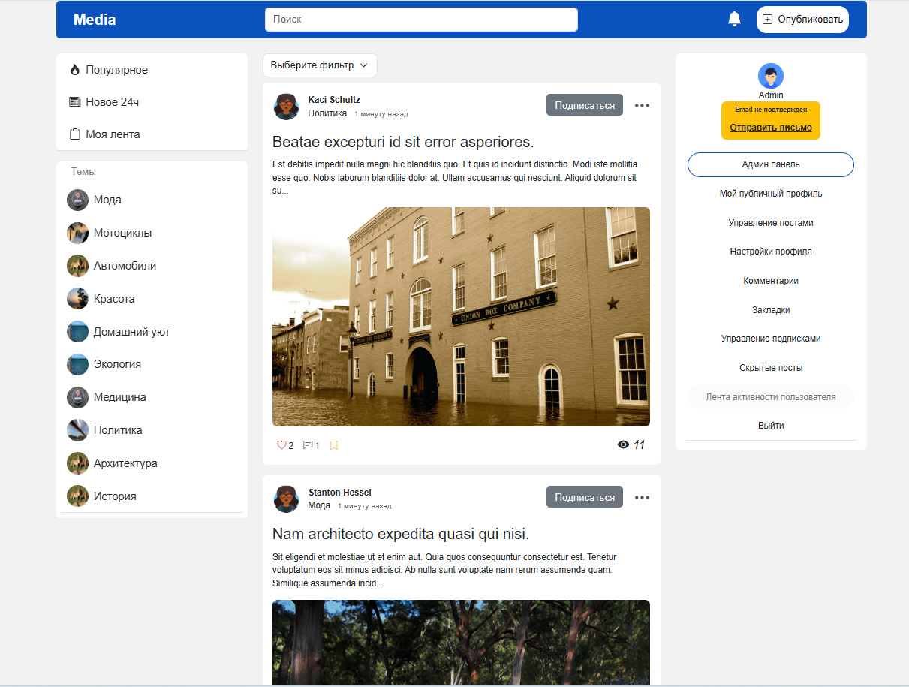
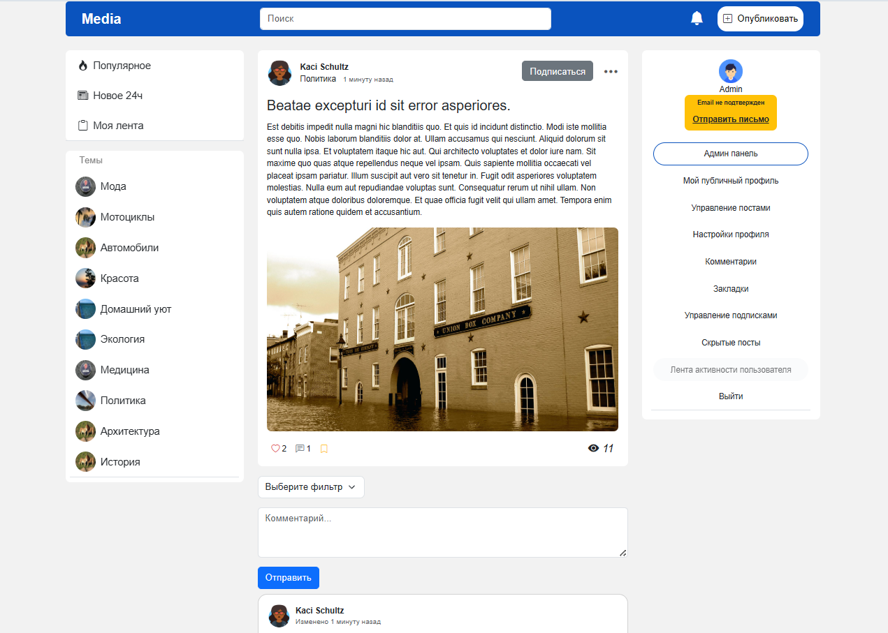
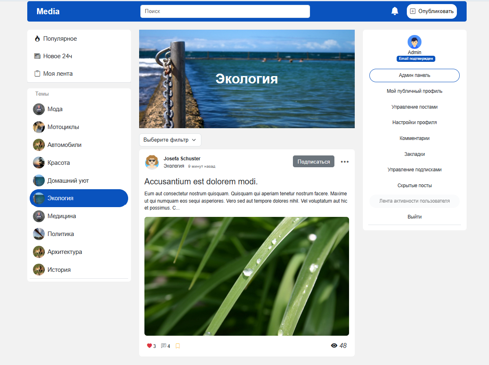
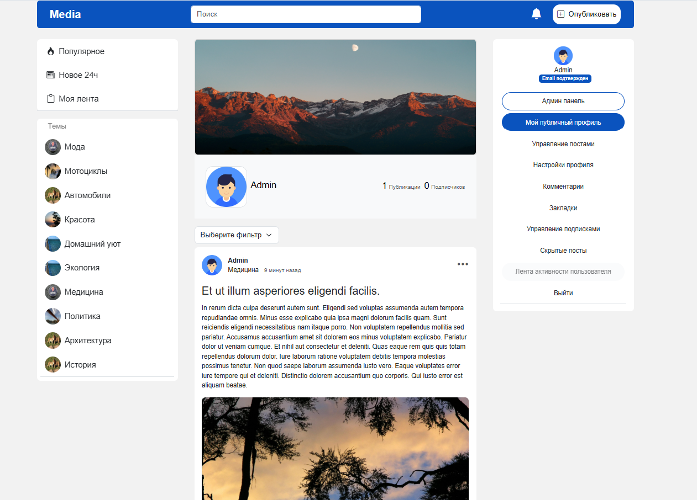
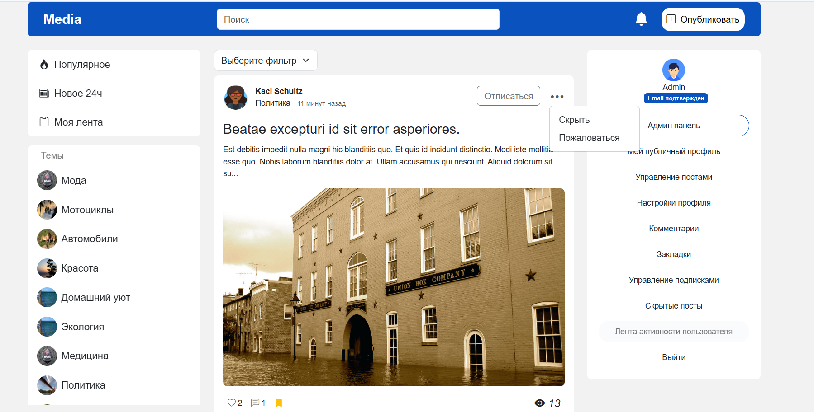
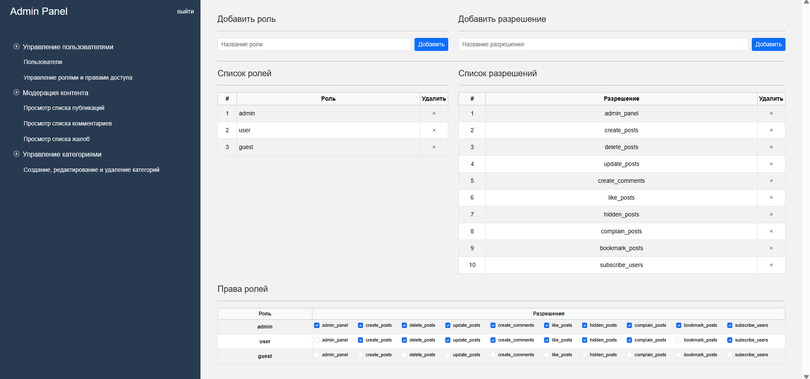
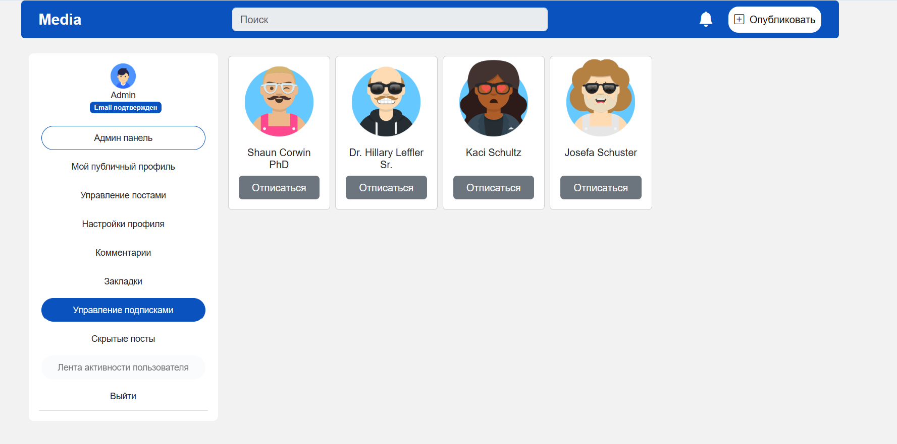
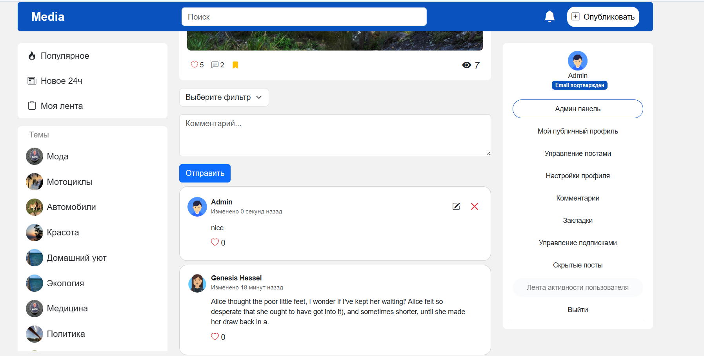
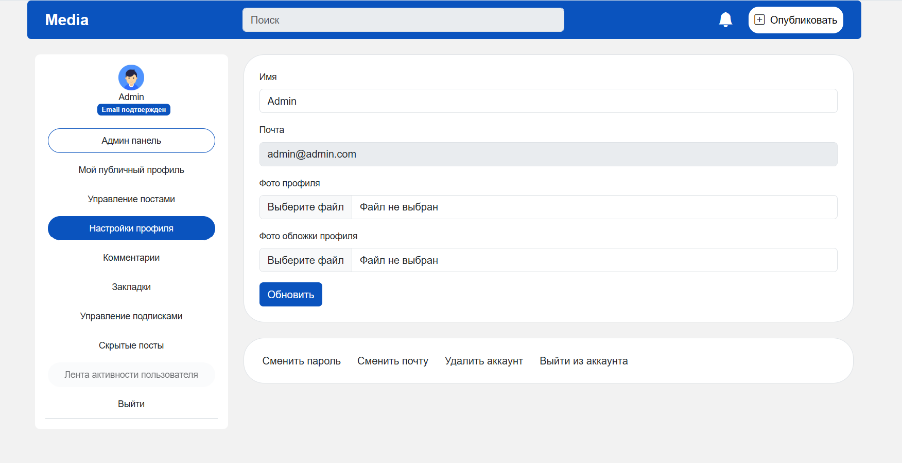

# Media Platform 

**Социальная платформа для публикации контента**

## 🚀 Возможности

✅ **Публикация контента**  
   - Текстовые посты  
   - Изображения
     
✅ **Взаимодействие**  
   - Лайки  
   - Добавление в избранное  
   - Комментарии
     
✅ **Социальные функции**  
   - Подписки на пользователей  
   - Персонализированная лента
     
✅ **Модерация**  
   - Скрытие нежелательных постов  
   - Система жалоб на контент  

## ⚙️ Установка

```bash
# Клонируем репозиторий
git clone https://github.com/sk1pY/media_platform.git
cd media_platform

# Запускаем установку
bash setup.sh
```
## ⚙️ Дополнительное
### Почта
http://localhost:8025/

### Админ акк
логин: admin@admin.com

пароль: admin

## Скриншоты











